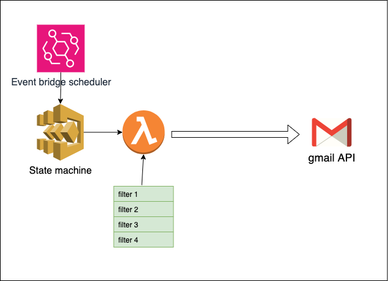

# mail-cleanup



# Add Docker Desktop for Mac (docker)

export PATH="$PATH:/Applications/Docker.app/Contents/Resources/bin/"

# Docker commands

```
open -a Docker #for Mac

docker login registry.gitlab.com # login is email address

docker build -t registry.gitlab.com/personal1741534/mail-cleanup/ubuntu-terraform .

docker run -it registry.gitlab.com/personal1741534/mail-cleanup/ubuntu-terraform /bin/bash

docker push registry.gitlab.com/personal1741534/mail-cleanup/ubuntu-terraform
```

# Install dependencies for lambda layer

```
pip install --upgrade google-api-python-client google-auth-httplib2 google-auth-oauthlib -t .
```

# pytest coverage command

```
pytest --cov-report=html --cov=src .
```
